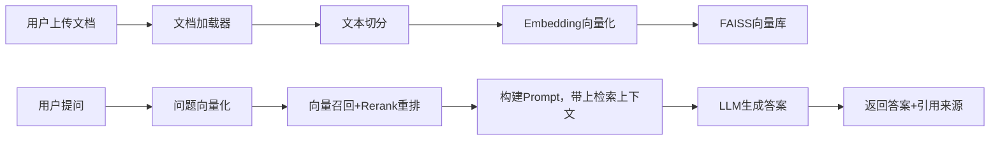

# RAG 私有知识库问答系统

## 项目简介

基于检索增强生成(RAG)构建本地私有知识库，支持PDF/Markdown文档上传，文档切片、向量化、向量检索，结合大模型回答用户问题，并且引用原文片段，缓解大模型幻觉问题。

本项目模块化设计，可替换embedding模型、向量库、LLM；支持FastAPI接口服务，Streamlit可视化页面，Docker一键部署。

**技术栈** Python 3.10 | LangChain | FAISS | Sentence-Transformers | FastAPI | Streamlit | Pytest

## 架构图



## 功能特性

- 📄 支持 **PDF / Markdown** 文档上传与解析（PDF 逐页、Markdown 按标题分块）
- ✂️ 可配置的文本切分（chunk_size / chunk_overlap），中文分隔符优化
- 🔍 FAISS 向量检索，归一化向量 + 内积等价余弦相似度，返回带相似度得分的引用片段
- 🤖 OpenAI 兼容 LLM 接口（DeepSeek / 通义千问 / OpenAI / Kimi 等均可，只需配置 base_url + api_key）
- 🧩 模块化设计：embedding 模型、向量库、LLM 均可独立替换
- 🚀 FastAPI 接口服务 + Streamlit 可视化页面 + Docker 一键部署

## 快速开始

### 1. 安装依赖（Python 3.10+）

```bash
# 推荐使用虚拟环境
python -m venv .venv
# Windows
.venv\Scripts\activate
# Linux / macOS
source .venv/bin/activate

pip install -e .
# 开发依赖（测试、Lint）
pip install -e ".[dev]"
```

### 2. 配置 LLM

复制示例环境变量（或直接修改 `configs/config.yaml`）：

```bash
# Windows PowerShell
$env:OPENAI_API_KEY="sk-xxx"
$env:OPENAI_BASE_URL="https://api.deepseek.com/v1"   # 按服务商填写
$env:LLM_MODEL="deepseek-chat"
```

> 首次启动会自动下载 embedding 模型（默认 `BAAI/bge-small-zh-v1.5`，约 100MB），
> 需保持网络可用；也可将 `configs/config.yaml` 的 `model_name` 改为本地已下载的模型。

### 3. 启动服务

```bash
# 方式一：FastAPI 接口服务
uvicorn api_server:app --host 0.0.0.0 --port 8000
# 或 python src/api_server.py

# 方式二：Streamlit 可视化界面
streamlit run src/webui.py
```

### 4. Docker 一键部署

```bash
docker compose up -d --build
# API 服务:  http://localhost:8000
# WebUI:     http://localhost:8501
```

### 5. 部署到 Streamlit 社区云（免费公网访问）

1. 将本仓库推送到 GitHub（公开仓库免费）；
2. 打开 https://share.streamlit.io ，用 GitHub 账号登录，选择本仓库；
3. 部署入口文件填 `src/webui.py`；
4. 在应用的 **Settings → Secrets** 中粘贴以下内容（Key 不会进入代码仓库）：

```toml
OPENAI_API_KEY = "sk-你的key"
OPENAI_BASE_URL = "https://api.deepseek.com/v1"
LLM_MODEL = "deepseek-chat"
```

> 注意：社区云容器为临时存储，重启/休眠后上传的文档索引会清空，需重新上传；
> API Key 只通过 Secrets 配置，切勿写进代码或提交到 GitHub。

## API 文档

启动后自动生成交互式文档：http://localhost:8000/docs

| 接口 | 方法 | 说明 |
|---|---|---|
| `/health` | GET | 健康检查，返回知识库文档块数量 |
| `/upload` | POST | 上传 PDF/Markdown 文档并入库（multipart/form-data，字段名 `file`） |
| `/ask` | POST | 问答，请求体 `{"question": "...", "top_k": 5}` |

`/ask` 响应示例：

```json
{
  "question": "系统支持哪些文档格式？",
  "answer": "系统支持 PDF 和 Markdown 格式。 [来源: README.md]",
  "sources": [
    {
      "content": "支持PDF/Markdown文档上传…",
      "score": 0.8123,
      "metadata": {"source": "README.md", "chunk_id": 3}
    }
  ]
}
```

```bash
# curl 示例：上传文档
curl -F "file=@example.pdf" http://localhost:8000/upload

# curl 示例：问答
curl -X POST http://localhost:8000/ask \
  -H "Content-Type: application/json" \
  -d '{"question": "系统支持哪些文档格式？"}'
```

## 配置说明

`configs/config.yaml` 为主要配置入口，关键项如下：

| 配置项 | 默认值 | 说明 |
|---|---|---|
| `embedding.model_name` | `BAAI/bge-small-zh-v1.5` | embedding 模型，可替换 |
| `splitter.chunk_size` | `500` | 切块长度 |
| `vector_store.index_dir` | `data/faiss_index` | 索引持久化目录 |
| `llm.base_url` | DeepSeek 兼容地址 | OpenAI 兼容接口地址 |
| `llm.api_key` | 空 | 建议用环境变量 `OPENAI_API_KEY` 注入 |

环境变量覆盖优先级：**环境变量 > YAML 默认值**。

## 测试

```bash
pytest -v
```

测试设计为**离线可跑**：不下载模型、不调用网络（检索链路使用确定性假向量），
覆盖加载器、切分器、向量库增删查与持久化往返。

## 项目结构

```
rag-knowledge-base/
├── README.md / LICENSE / .gitignore / pyproject.toml
├── Dockerfile / docker-compose.yml
├── src/
│   ├── document_loader/   # PDF / Markdown 加载器
│   ├── text_splitter/     # 文本切分器
│   ├── embedding/         # Embedding 模型封装
│   ├── vector_store/      # FAISS 向量库
│   ├── config.py          # 配置加载
│   ├── rag_chain.py       # RAG 问答链路
│   ├── api_server.py      # FastAPI 服务
│   └── webui.py           # Streamlit 界面
├── tests/                 # 单元测试
├── configs/config.yaml    # 配置文件
├── docs/                  # 架构与优化文档
├── experiments/           # 实验记录
└── .github/workflows/     # CI
```

## 扩展指南

- **新增文档格式**：实现一个加载器类，`load()` 返回 `List[Document]`，在 `LOADERS` 注册扩展名；
- **更换 embedding 模型**：改 `config.yaml` 的 `model_name`（sentence-transformers 模型均可）；
- **更换 LLM**：改 `base_url` / `model` / `api_key`（OpenAI 兼容协议）；
- **更换向量库**：实现 `add_documents / search / save / load` 同接口即可。

## 优化方向

详见 [docs/optimization.md](docs/optimization.md)：混合检索（BM25+向量）、Rerank 重排、
查询改写、IVF/HNSW 索引、查询缓存等。

## License

[MIT](LICENSE)
