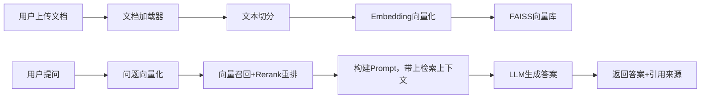
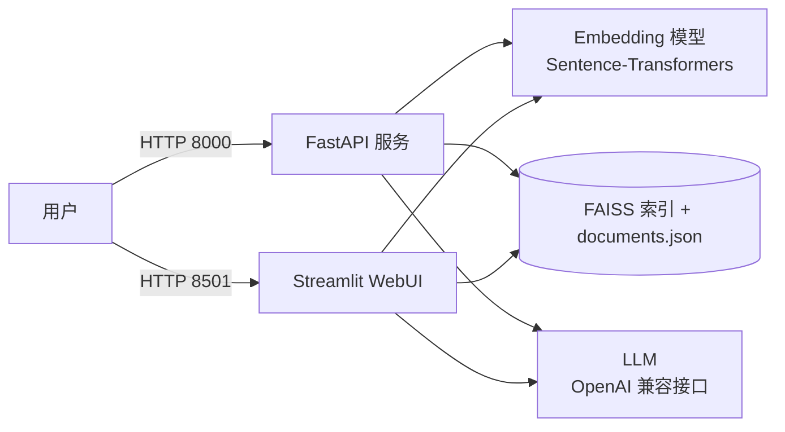

# RAG 私有知识库架构

## 1. 系统概述

基于**检索增强生成（Retrieval-Augmented Generation）**构建的本地私有知识库问答系统：

- 文档进入系统后经过 **加载 → 切分 → 向量化 → 入库** 四条流水线；
- 用户提问时经过 **问题向量化 → 向量召回 → Prompt 组装 → LLM 生成** 四条流水线；
- 最终返回 **答案 + 引用来源**，缓解大模型幻觉。

设计原则：**模块化、可替换**。embedding 模型、向量库、LLM 三个组件均可独立替换，
互不影响。

## 2. 端到端数据流



## 3. 模块说明

| 模块 | 路径 | 职责 | 可替换点 |
|---|---|---|---|
| 文档加载器 | `src/document_loader/` | PDF（逐页）、Markdown（按标题）解析为统一 `Document` | 新增 `.docx` 等格式只需实现同接口加载器 |
| 文本切分 | `src/text_splitter/` | 递归字符切分，可配 `chunk_size / overlap` | 可换语义切分（按句、按段落） |
| Embedding | `src/embedding/` | 文本 → 稠密向量（默认 bge-small-zh-v1.5） | 改 `config.yaml` 的 `model_name` 即可 |
| 向量库 | `src/vector_store/` | FAISS 向量索引 + 原文/元数据持久化 | 可换 Milvus / Chroma / PGVector |
| RAG 链路 | `src/rag_chain.py` | 召回 → Prompt → LLM → 答案+引用 | LLM 走 OpenAI 兼容协议，任意服务商 |
| 接口服务 | `src/api_server.py` | FastAPI：`/upload` `/ask` `/health` | - |
| WebUI | `src/webui.py` | Streamlit 可视化交互 | - |
| 配置 | `src/config.py` + `configs/config.yaml` | YAML 默认值 + 环境变量覆盖 | - |

## 4. 核心数据结构

```python
@dataclass
class Document:
    page_content: str          # 文档正文 / 切分后的块
    metadata: dict             # source / page / heading / chunk_id 等溯源信息
```

- `FaissStore` 中：FAISS 索引存向量，`documents.json` 按下标一一对应存原文与元数据；
- `RAGChain.answer()` 返回 `{question, answer, sources}`，`sources` 携带原文片段与相似度得分，供引用展示。

## 5. 相似度计算

- Embedding 默认输出 **L2 归一化向量**（`normalize: true`）；
- 向量库使用 `IndexFlatIP`（内积）检索，归一化后等价于**余弦相似度**；
- 得分范围为 [-1, 1]，越接近 1 越相关。

## 6. 部署形态



- 本地开发：`uvicorn api_server:app` / `streamlit run src/webui.py`
- Docker 部署：`docker compose up -d`，`data/` 目录挂载持久化索引

## 7. 目录结构

```
rag-knowledge-base/
├── README.md / LICENSE / .gitignore / pyproject.toml
├── Dockerfile / docker-compose.yml
├── src/
│   ├── document_loader/   # PDF / Markdown 加载器
│   ├── text_splitter/     # 文本切分器
│   ├── embedding/         # Embedding 模型封装
│   ├── vector_store/      # FAISS 向量库
│   ├── config.py          # 配置加载（YAML + 环境变量）
│   ├── rag_chain.py       # RAG 问答链路
│   ├── api_server.py      # FastAPI 服务
│   └── webui.py           # Streamlit 界面
├── tests/                 # 单元测试（离线可跑）
├── configs/config.yaml    # 配置文件
├── docs/                  # 架构与优化文档
├── experiments/           # 实验记录
└── .github/workflows/     # CI
```
